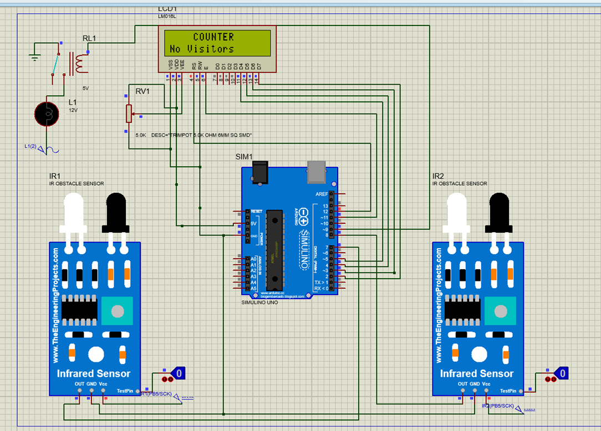

Automatic Room Lighting System with Bidirectional Visitor Counter

Overview
This project is an embedded system designed to automatically control room lighting based on occupancy. 
It uses infrared sensors and a bidirectional visitor counter to determine the number of people in the room, turning the lights on when someone enters and off when the room is empty. 
The system aims to reduce unnecessary energy consumption and improve convenience by automating the lighting process.

Features
Automatic Lighting Control: Lights are automatically turned on or off based on room occupancy.
Bidirectional Visitor Counter: Tracks the number of people entering and leaving the room to determine occupancy.
Energy Efficiency: Helps reduce energy consumption by ensuring lights are only on when the room is occupied.
User Control via Bluetooth: Allows manual control of the lighting system using a Bluetooth-connected device.
I2C Communication: Facilitates communication between components.

Components
Arduino Uno: The main microcontroller used for processing input from sensors and controlling the lighting system.
HC-06 Bluetooth Module: Enables wireless communication for manual control of the lighting system.
Infrared Sensors: Detects the presence of people entering or leaving the room.
Relay Module: Controls the electrical connection to the room's lights.
Bidirectional Visitor Counter: Tracks the number of people in the room.

Proteus simulation circuit

Installation

Hardware Setup:
Connect the infrared sensors at the entrance to detect motion.
Wire the Arduino Uno to the relay module and Bluetooth module.
Connect the lighting system to the relay module.

Software Setup:
Upload the provided Arduino sketch to the Arduino Uno.
Pair the Bluetooth module with a smartphone for manual control.

Power On:
Connect the system to a power source, and the automatic lighting system will start functioning based on occupancy.

Usage
Automatic Mode: The system will automatically control the lights based on the number of people in the room.
Manual Mode: Use the Bluetooth app to turn the lights on or off manually.
Sensor Range Issues: If the infrared sensors do not detect people accurately, adjust their positioning or sensitivity.
Bluetooth Connection Issues: Ensure that the HC-06 module is correctly paired with your device and that the Arduino is powered on.
Future Enhancements
Integration with Smart Home Systems: Adding compatibility with smart home platforms like Google Home or Alexa.
Remote Monitoring: Implementing a feature to monitor room occupancy remotely via a mobile app.

For More Clear Understanding
https://medium.com/@priyadharshaninavarathnam/automatic-room-lighting-system-with-bidirectional-visitor-counter-bc833bd1bcff

